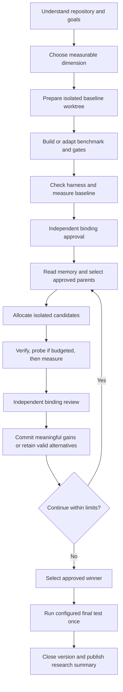

# OLO: Workflow, Strategies, and Session Improvements

Updated: 2026-09-06.

This document explains what OLO can do at each stage of a research run, which
strategies it supports, what changed during this implementation session, and
what the bank retrieval POC actually demonstrated. It describes the implemented
system, not a proposal for future work.

Use [README.md](README.md) for the short setup guide. This document is the deeper
operating guide. A particular run also has its own generated research summary;
the completed sample is available at
[../poc/.olo/report.md](../poc/.olo/report.md) in this workspace.

## Contents

- [What OLO Does](#what-olo-does)
- [What Changed This Session](#what-changed-this-session)
- [Ownership and Trust](#ownership-and-trust)
- [Explore and Choose a Goal](#explore-and-choose-a-goal)
- [Build and Approve the Baseline](#build-and-approve-the-baseline)
- [Configuration Reference](#configuration-reference)
- [Define Meaningful Improvement](#define-meaningful-improvement)
- [Read Research Memory and Propose Work](#read-research-memory-and-propose-work)
- [Choose Parents and Strategies](#choose-parents-and-strategies)
- [Size and Run Rounds](#size-and-run-rounds)
- [Execute and Review a Candidate](#execute-and-review-a-candidate)
- [Combine Experiments](#combine-experiments)
- [Stop and Run the Final Test](#stop-and-run-the-final-test)
- [Evidence and Recovery](#evidence-and-recovery)
- [Reports and Dashboard](#reports-and-dashboard)
- [Command Reference](#command-reference)
- [Session Case Study](#session-case-study)
- [Verification and Limitations](#verification-and-limitations)
- [Implementation Map](#implementation-map)

## What OLO Does

OLO is a repository-local research control plane for agent-driven code
improvement. An agent proposes and implements changes. A benchmark measures
them. Gates protect important behavior. The controller preserves evidence and
controls which snapshots can become parents for subsequent work.

The central question is not simply, "Did the number go up?" It is:

> Did a valid, reviewable change improve the declared objective under the same
> measurement conditions, without violating the configured constraints?

The lifecycle is:



There are two primary agent workflows:

| Workflow | Purpose | Exit condition |
|---|---|---|
| `/olo-explore` | Define what better means and establish trustworthy measurement | Approved baseline and `phase=ready-to-optimize` |
| `/olo-optimize` | Explore changes against that fixed measurement | Declared bounded stop, ceiling, stall, or another justified stop |

The main configuration phases are:

| Phase | Meaning | Normal transition |
|---|---|---|
| `exploring` | Goal and measurement are being established | Configure the prepared baseline |
| `ready-for-baseline` | Measurement is configured, but no approved baseline permits optimization | Measure baseline and obtain independent approval |
| `ready-to-optimize` | An approved baseline is available | Run bounded experiments, then finalize if configured |
| `finalized` | Final-test exposure has closed the version | Archive and create a new version to continue research |

Discovery status, experiment status and mode status are separate fields.
`dimensions-proposed` or `dimension-selected` describes discovery;
`pending-review` describes an experiment, not a separate configuration phase.
A measured but unapproved baseline normally remains in `ready-for-baseline`.
After finalization, an older discovery milestone can still say
`ready-to-optimize`; the main `phase=finalized` is the closing constraint.

Final testing is a distinct closing step when configured. OLO does not merge a
winner into the main branch automatically. Keeping an experiment and shipping
its code are different decisions.

### Local Setup

The kit consists of the CLI entrypoint, Python control plane, repository-local
skills, six custom agent roles, hooks and dashboard assets. The setup guide
lists the exact copy paths. Normal controller use needs Git and Python 3.10+;
the agent workflow also needs GitHub Copilot CLI, and repository hooks use
PowerShell 7+ on Windows. The product being optimized can have additional
dependencies of its own.

Run commands from the repository that contains the installed kit. From another
directory, point to the entrypoint and pass the global `--repo` option before
the subcommand. Command examples in this document are illustrative workflow
fragments, not a script to rerun against the already finalized POC.

Evo inspired the two-phase research process. This session did not turn OLO into
an Evo backend, add remote sandbox providers or implement a general genetic
algorithm. OLO's crossover is explicit source-tracked experimental reuse.

## What Changed This Session

OLO already had exploration, isolated worktrees, benchmarks, gates, agents,
frontier strategies, and a dashboard. This session strengthened the evidence,
decision, and reuse rules around that foundation.

| Area | Problem addressed | Implemented behavior |
|---|---|---|
| Measurement versions | A small or repeatedly used benchmark can saturate | Frozen measurement manifest, explicit versions, archive-and-rebaseline workflow |
| Independent approval | A favorable score could become trusted before semantic review | Measured snapshots wait in `pending-review`; binding approval controls reuse |
| Improvement threshold | Tiny gains could be called progress despite declared expectations | Numeric absolute and relative gain thresholds |
| Task-level protection | Aggregate gains can hide losses or missing tasks | Directional task deltas, expected coverage, configurable critical-task regression limits |
| Specialists | Useful alternatives were too easy to lose | Approved `retained` snapshots remain eligible without being called aggregate progress |
| Historical parents | Having children should not make a useful ancestor unusable | Frontier selection considers eligible ancestors, not just leaves |
| Crossover | Cross-branch ideas lacked explicit source attribution | `recombine` records base, donors, donor commits, and intended contributions |
| Research memory | Verification chatter and speculative prose can obscure useful lessons | Evidence-linked notes, tags, observation/hypothesis labels, relevance filtering, supersession |
| Proposal tracking | Similar ideas or unfinished claims can be repeated | Stable proposal IDs, deduplication and lifecycle updates |
| Exploratory trials | A failed or abandoned idea could exist only in prose | Recorded probes with scores, logs, traces, source fingerprints, and diffs |
| Setup and budgets | Cache/setup failures and hidden reruns distort research accounting | Separate preflight evidence; probes and checks count toward evaluation budgets |
| Invalid evidence | Descendants can inherit a bad source | Explicit invalidation propagates through parent and donor dependencies |
| Final testing | Repeatedly checking a held-out set makes it development feedback | Once-only final exposure closes optimization for that version |
| Run explanation | A result number does not explain the research process | Generated human-readable Markdown summary with evidence links |
| Dashboard | Dense state and long text made review awkward | Clearer statuses, evidence details, donor visibility, report viewer/download, responsive layout |

These changes make research more auditable and disciplined. They do not prove
that every run will find a better algorithm, cost less, or generalize to
production.

## Ownership and Trust

### Agent Responsibilities

| Role | Main responsibility | Important boundary |
|---|---|---|
| `olo-explorer` | Understand the repository, rank dimensions, establish measurement | Harness construction belongs in the prepared baseline worktree |
| `olo-orchestrator` | Select work, assign budgets, coordinate reviews and stopping | Does not implement candidate product changes |
| `olo-ideator` | Propose diverse, evidence-based hypotheses | A proposal is not a measured result |
| `olo-experimenter` | Implement one bounded hypothesis in its allocated worktree | Does not approve its own candidate |
| `olo-verifier` | Inspect validity and record an independent binding review | Approval must refer to the measured snapshot |
| `olo-benchmark-reviewer` | Audit measurement and interpret task-level evidence | A narrative explanation cannot replace raw evidence |
| User | Set goals, approve scope, decide what to ship | No automatic winner merge |

The Python controller owns artifact paths, state transitions, numerical
decisions, budget counters, source eligibility, and integrity checks. The
benchmark owns the score. Gates own their pass/fail assertions.

### Enforcement Versus Policy

The controller checks source fingerprints, Git commits, gate results, task
coverage, measurement identity, and eligibility before accepting a binding
approval. It does not authenticate the human or model behind a reviewer name.
Independent reviewer separation is an agent workflow requirement, not an
identity-security boundary.

Likewise, worktrees isolate files, not operating-system access. Agents are
instructed not to inspect final questions. The local process can detect certain
violations and block forbidden workflow actions, but it is not a secure sandbox
that proves no one read a file.

## Explore and Choose a Goal

Exploration begins with working code and a committed repository. The goal can
be supplied by the user or derived from repository evidence.

The explorer examines product promises, entry points, tests, known failures,
dependencies, examples, and operational constraints. It records candidate
dimensions rather than assuming that "improvement" always means correctness.

Examples include correctness rate, retrieval quality, latency, memory,
throughput, and cost. Each needs an explicit numerical definition and a
direction: `max` for higher-is-better or `min` for lower-is-better.

Useful dimension evidence answers:

1. Which behavior matters, and where is it implemented?
2. What observed gap makes improvement plausible?
3. Can a repeatable benchmark represent it?
4. What behavior must remain unchanged?
5. How difficult is harness construction and each repeated run?
6. How might a candidate game the measurement?

Dimensions record construction complexity (`none`, `minor`, `substantial`) and
run cost (`small`, `medium`, `large`). The explorer prioritizes and selects a
goal using evidence; the controller records that explicit choice. This is not
the frontier algorithm, and OLO does not automatically switch between several
objectives during a frozen run.

The normal command sequence starts with:

```bash
python -B olo.py explore init --name my-project --goal "Improve retrieval quality"
python -B olo.py explore status
python -B olo.py explore add-dimension --name retrieval-quality --description "Improve relevant document ranking" --target src/retriever.py --metric-name "mean nDCG at 5" --direction max --evidence "Relevant documents are displaced by topical distractors" --complexity minor --run-cost small
python -B olo.py explore list-dimensions
python -B olo.py explore select --name retrieval-quality
python -B olo.py baseline --prepare
```

The dimension must be recorded before it can be selected. The last command
allocates the baseline worktree; it does not declare a score or approve it.

## Build and Approve the Baseline

### Harness Strategies

| Origin | When to use it | Required work |
|---|---|---|
| `existing` | A suitable benchmark already emits the required contract | Check coverage, integrity and repeatability |
| `wrapped` | Existing tests or evaluation need a reporting adapter | Add numerical output and per-task evidence without changing the intended behavior |
| `constructed` | No suitable measurement exists | Build representative cases, scoring and at least one real gate |

The benchmark, gates, fixtures and instrumentation belong in the prepared
`exp_0000` worktree, not in main as a side effect of exploration. Candidate
worktrees later inherit that measurement foundation.

Preparing a baseline is different from measuring it. Preparation creates a
place to construct the harness while product behavior remains the baseline.
Baseline measurement produces a snapshot that still needs independent approval.

### Benchmark Contract

OLO supplies these environment variables:

| Variable | Meaning |
|---|---|
| `OLO_EXPERIMENT_ID` | Experiment being evaluated |
| `OLO_WORKTREE` | Absolute worktree path |
| `OLO_TARGET` | Absolute configured target path |
| `OLO_RESULT_PATH` | Result-file destination for this invocation |
| `OLO_TRACES_DIR` | Per-task trace directory for this invocation |

A typical result is:

```json
{
  "score": 0.75,
  "tasks": {
    "case-1": 1.0,
    "case-2": 0.5
  }
}
```

The harness must honor the supplied destinations. The POC initially wrote to
its own split-specific folders; contract tests caught that mismatch and the
development and final entrypoints were fixed to use OLO's exact paths.

Commands execute with the experiment worktree as their working directory.
`{target}`, `{worktree}` and `{repo}` placeholders are shell-quoted and expanded;
in benchmark commands, `{repo}` refers to the worktree, not the main checkout.
Gates run after successful benchmark execution and use exit status for
pass/fail. The configured timeout applies to each command, not the sum of every
benchmark and gate in a study.

The result parser prefers the JSON result file and also supports JSON output
and a compatibility `score` fallback from stdout. A finite aggregate score is
required. Prefer the full JSON contract: a bare score cannot support meaningful
per-task analysis, and an established expected task set prevents silently
dropping tasks in later candidates.

Task traces should explain the score, not merely repeat a success label. For
retrieval, the relevant evidence includes the question, expected documents,
ranked results and coverage. A trace labeled `passed` can still have partial
relevance coverage.

### Benchmark, Validation and Final Test

| Measurement | Used during optimization? | Purpose |
|---|---|---|
| Development benchmark | Yes, scores and traces guide changes | Measure the objective and expose failure modes |
| Regression gates | Yes | Protect existing behavior and other constraints |
| Repeated validation gate | Yes, at least its pass/fail outcome is observed | Detect some regressions outside the development cases |
| Final test | Once after selection | Obtain a closing assessment that cannot feed further tuning in this version |

Repeated validation is not an untouched final test. Even a pass/fail signal can
influence subsequent choices. The final set must remain outside experimenter
feedback until selection is complete.

### Baseline Approval

After configuration and harness review:

```bash
python -B olo.py run exp_0000 --check
python -B olo.py baseline
python -B olo.py review exp_0000 --verdict approve --reviewer independent-reviewer --reason "Checked scope, gates, traces, and measurement integrity."
```

The review command is performed by the independent reviewer, not the baseline
author. A check saves evidence without becoming the approved baseline and
without consuming an experiment attempt. It still consumes an evaluation.

The controller records a measurement manifest binding protected files and
measurement settings. Baseline approval establishes the expected task set and
makes the optimization phase available.

One recovery improvement matters in ordinary development: the initial baseline
allocation requires a clean main checkout, but reusing an already prepared
isolated baseline is not blocked merely because unrelated main files changed.
Those main edits are preserved.

## Configuration Reference

Configure measurement in the prepared baseline worktree before its measured
snapshot is frozen. `explore configure` records both executable settings and
the human explanation of the measurement plan.

| Group | CLI options | Meaning |
|---|---|---|
| Product scope | `--target`, repeatable `--editable` | Primary target and allowed product-edit paths |
| Measurement scope | Repeatable `--protect` | Files or directories that candidates must not change |
| Benchmark | `--benchmark`, `--benchmark-origin`, `--metric`, `--unit` | Command, origin, direction and meaning of one evaluated item |
| Gates | Repeatable `--gate "NAME::COMMAND"` | Independently named pass/fail commands |
| Measurement explanation | `--determinism`, `--resource-profile`, `--meaningful-improvement`, `--repo-summary` | Expected variability, constraints and plain-language purpose |
| Risk inventory | Repeatable `--gaming-risk`, `--future-dimension` | Known ways to game the score and goals postponed for later |
| Gain policy | `--min-improvement`, `--min-relative-improvement` | Numeric thresholds; defaults are `0.01` absolute and `0.0` relative |
| Task protection | Repeatable `--critical-task`, `--max-task-regression` | Tasks subject to explicit regression limits |
| Search | `--strategy`, `--frontier-k`, `--epsilon`, `--temperature` | Parent-ranking preferences |
| Run limits | `--timeout`, `--max-attempts`, `--max-evaluations` | Per-command timeout, per-candidate measured-attempt cap and total pre-final evaluation cap |
| Stopping | `--stall-limit`, `--score-ceiling` | Consecutive non-progressing rounds and terminal score target |
| Evaluation identity | `--evaluation-version`, `--final-test` | Version label and once-only closing command |

`--meaningful-improvement` is explanatory prose. It does not replace
`--min-improvement` or `--min-relative-improvement`. Writing "a 1% gain is
required" in a description does not itself change numerical acceptance.

The determinism choices are `deterministic`, `temp-zero` and `noisy`. This is
descriptive metadata saved in configuration, the discovery plan and project
notes; the runner does not select different execution behavior from it.
Declaring one does not automatically seed a benchmark, change model temperature
or create statistical replicates. For noisy benchmarks, aggregate planned
replicates within the harness and report the predeclared decision statistic;
do not keep the best lucky invocation.

### What Is Frozen

The measurement digest binds the evaluation version, benchmark and gate
commands, metric, target, editable and protected scope, final-test command,
absolute/relative gain thresholds, critical-task policy and score ceiling. It
also hashes the configured protected files, excluding recognized generated
artifacts.

Changing one of those measurement ingredients requires a fresh evaluation
version and baseline. Search preferences and resource counters are separate
from the measurement digest. An unhashed field is not permission to silently
change the study's agreed constraints.

The approved baseline establishes `expected_tasks` from its measured task map.
Task IDs and scores still need to mean what the benchmark claims; the
controller does not invent a correct ground truth.

## Define Meaningful Improvement

### Numerical Rule

Let $p$ be the parent score and $c$ the candidate score. Directional gain is:

$$
g =
\begin{cases}
c-p & \text{for a maximized metric} \\
p-c & \text{for a minimized metric}
\end{cases}
$$

The required gain is:

$$
t = \max(\text{min\_improvement}, |p|\times\text{min\_relative\_improvement})
$$

A non-baseline candidate needs positive gain meeting that threshold, valid
coverage, and no blocked critical regression to qualify as meaningful. The
implementation uses a small floating-point tolerance. Passing these numerical
conditions does not bypass verification, gates or independent review.

For example, with an absolute threshold of `0.01`, improving `0.90` to `0.905`
is not progress. It can still be a valid result worth retaining.

For a maximized parent score of `0.80`, an absolute threshold of `0.01` and a
relative threshold of `0.02` require `max(0.01, 0.80 * 0.02) = 0.016` gain.
A candidate scoring `0.815` falls short; `0.816` meets the numerical threshold,
subject to all other validity and approval checks.

### Task-Level Rules

OLO records improved, regressed, unchanged, missing and added task IDs, plus
directional deltas against each relevant source. Positive directional deltas
always mean better, including when the raw metric is minimized.

`expected_tasks` checks exact task-set coverage. `critical_tasks` and
`max_task_regression` impose stricter limits on specifically designated tasks.
The latter is not a blanket prohibition on all task regressions. In the sample,
the critical list was empty; the observed absence of regressions came from the
results, while the validation gate separately enforced its frozen floor.

### Validity, Progress and Reuse Are Different

| State or result | Meaning | Eligible as a parent? |
|---|---|---|
| `pending` | Allocated, not yet an approved measured snapshot | No |
| `active` | Evaluation in progress | No |
| `pending-review` | Saved measured snapshot awaiting binding review | No |
| `committed` | Approved baseline or approved meaningful improvement against its parent | Yes, if dependencies remain eligible |
| `retained` | Approved valid alternative that is not a meaningful aggregate gain | Yes, if dependencies remain eligible |
| `evaluated` / `failed` | Evaluation did not produce an accepted valid candidate | No |
| `discarded` | Direction closed with a recorded reason | No |
| `invalid` | Rejected or invalidated evidence | No |
| Probe record | Exploratory evidence, not a reviewed candidate state | No |
| Preflight block | Setup or validity problem before benchmark execution | No |

A measured snapshot can already have a Git commit while its OLO status is
`pending-review`. The existence of that commit does not make it trusted.

An experiment can improve its own weaker parent without beating the global
best. Round progress is computed from the best approved result before and after
the round, using the configured meaningful-gain rule.

The default `best_experiment` is selected from eligible `committed` nodes, not
all retained nodes. A retained candidate can have a slightly higher raw score
without becoming the reported winner. There is no automatic code-complexity
metric or "simplest program" tie-breaker. In the POC, the simpler winner stayed
selected because the equal-scoring crossover was retained, not committed.

## Read Research Memory and Propose Work

Before a round or retry, read shared research context:

```bash
python -B olo.py scratchpad --parent exp_0000 --query "negation and role matching"
python -B olo.py frontier --limit 3
python -B olo.py traces exp_0000
```

The scratchpad brings together status, experiment relationships, failed
directions, and relevant lessons. This is how one worker can benefit from
another worker's results without blindly copying its code.

### Evidence-Linked Learning

Use an observation for what was measured, and a hypothesis for an explanation
or prediction that remains uncertain:

```bash
python -B olo.py learn exp_0002 --kind observation --tag intent --text "Only the explicit document-kind task improved; the other tasks did not change."
python -B olo.py learn exp_0002 --kind hypothesis --tag intent --text "Explicit labels may help when topical cues favor the wrong kind of document."
```

Learning records can carry tags, evidence pointers and supersession links. A
corrected note should supersede the older note rather than silently erase it.
Superseded material remains historical evidence but is excluded from future
learning context. Verification annotations are not treated as the main research
memory stream.

The current retrieval strategy is intentionally lightweight:

- tokenize the query, note text and tags into lowercase alphanumeric terms of
  at least three characters;
- add two relevance points per overlapping query term;
- add four points when a note belongs to the requested parent's ancestor or
  donor lineage;
- order by relevance, then recency and ID, and apply the requested limit;
- exclude verification/review annotations and superseded entries.

This is lexical, lineage-aware retrieval, not an embedding database or a new
LLM synthesis pass. A learning must reference an experiment with saved
evidence; its evidence link defaults to that experiment's latest saved record.
Old notes are not automatically rewritten when a new trial is run.

Structured memory does not make prose true. The controller cannot infer that
an agent's causal explanation is correct. Reviewers and future workers must
compare it with saved task facts.

### Proposals

Proposals track an idea before and during execution. Stable IDs connect them to
experiments. Lifecycle states include `proposed`, `claimed`, `tested`,
`rejected`, and `superseded`. Deduplication helps avoid repeating equivalent
recorded ideas; it is not a semantic proof that two differently worded ideas
are the same.

Specifically, deduplication compares the same parent and hypothesis after
lowercasing and collapsing whitespace, excluding rejected/superseded proposals.
It is not fuzzy matching on the proposal title.

| Current state | Allowed next states |
|---|---|
| `proposed` | `claimed`, `rejected`, `superseded` |
| `claimed` | `tested`, `proposed`, `rejected`, `superseded` |
| `tested` | `superseded` |
| `rejected` / `superseded` | Terminal |

An unsuccessful test is still a tested proposal. Close its claim explicitly
when necessary, and state the changed condition before retrying that direction.

### Choosing Different Experimental Directions

Frontier selection answers "which parent?" Ideation answers "which change?"
Useful experiment strategies include failure-cluster repair, a narrow mutation
of the leader, a sibling from a historical ancestor, specialist development,
ablation to test a mechanism, and explicit recombination. Those are agent
research choices, not five separate automatic optimizers in the controller.

The optimize protocol calls for fresh ideation on the first round, after a
non-improving round or clustered failures, and periodically after committed
experiments. Different briefs should predict different task effects rather
than ask several workers to make the same vague improvement.

## Choose Parents and Strategies

Eligibility is checked before ranking. A candidate must be approved, have a
reusable status, not be retired, and have eligible parents and donors. Invalid
dependencies disqualify descendants even if their own score looks attractive.

Historical approved ancestors remain available. A baseline does not disappear
merely because a child was created. Retained specialists can also be chosen.

### Frontier Strategies

These existing strategies now operate on the expanded approved candidate set:

| Strategy | Actual behavior | Useful when |
|---|---|---|
| `argmax` | Orders by directional aggregate score; default selection size is one | Exploit the current aggregate leader |
| `top-k` | Orders by aggregate score and returns several leading candidates | Keep a small group of strong alternatives |
| `epsilon-greedy` | Usually puts the leader first; sometimes chooses an eligible exploratory parent | Avoid always following the same branch |
| `softmax` | Samples an order without replacement using score-based exponential weights | Prefer strong parents without making selection fully greedy |
| `pareto-per-task` | Counts first-place finishes on common task IDs, including ties, then uses aggregate score as a tie-breaker | Preserve alternatives that are strong on different tasks |

Important implementation details:

- `pareto-per-task` is a task-win ranking heuristic, not a general
  non-dominated multi-objective Pareto solver.
- It uses the intersection of task IDs across candidates. If there are no
  common tasks, it falls back to aggregate ordering.
- Tied best task results count as wins for each tied candidate.
- Higher softmax temperature flattens preferences; lower temperature favors
  stronger scores. The implementation clamps temperature away from zero.
- Epsilon and softmax randomness are seeded from the graph's node count.
  Repeating selection on an unchanged graph is not fresh independent sampling.
- An explicit `--limit` controls the returned selection size, including when
  the strategy's default would return one.

Frontier choice is a parent-selection strategy, not a claim that the selected
parent will yield the best next mutation.

## Size and Run Rounds

A round is a bounded set of workers and evaluations. Choose concurrency from
the binding resource, not from how many worktrees Git can create.

| Resource constraint | Sensible starting width |
|---|---|
| Exclusive GPU, port, device, shared mutable database or external fixture | 1 |
| Timing benchmark sensitive to sibling load | 1 until concurrency is validated |
| Rate-limited API | Concurrency safe for the quota |
| CPU-light isolated deterministic evaluation | A small measured-safe width |
| Unknown resource behavior | 1 |

```bash
python -B olo.py mode start --bounded
python -B olo.py round start --width 2 --budget 2
```

### Budget Semantics

`budget` is the planned allowance per worker. The controller enforces a shared
round cap of `width * budget`, not an independently metered quota per worker.
The orchestrator must honor each worker's assignment.

| Action | Consumes an experiment attempt? | Consumes evaluation budget? |
|---|---|---|
| Measured `run` after successful preflight | Yes | Yes |
| Recorded `probe` | No | Yes |
| Benchmark-bearing `run --check` | No | Yes |
| Setup/preflight block before the benchmark | No | No |
| Reading saved outcomes, traces or diffs | No | No |

`max_attempts` and `max_evaluations` are different controls. The global
evaluation cap also counts baseline checks and measurement; baseline work is
not charged against a non-baseline round's allocation.

Practical assignments:

- Budget 1: one measured candidate and no exploratory probe.
- Budget 2: one recorded probe followed by one measured candidate.
- Larger budgets: use only when the expected information justifies more
  recorded evaluations, with room left for a reviewable measured result.

Do not rerun a benchmark simply to retrieve output. Read the saved artifact.
Do not reset or increase a budget to conceal accidental duplicate work.

### Bounded and Autonomous Modes

Bounded mode follows the user-declared stopping boundary. Autonomous mode
continues under the workflow until the configured ceiling or stall rule says
to stop, or another constraint requires stopping. The mode flag alone is not
a background experiment scheduler; the agent/orchestrator drives the work.

Closing a round records the best before and after, whether the change is
meaningful, and the updated stall count. It refuses to close while an
evaluation or pending review remains active. The orchestrator should also
resolve unfinished allocated work before declaring the study complete.

A meaningful improvement in the global committed best resets `stall_count`
to zero. Otherwise it increments by one, including rounds that produce only
retained alternatives or unsuccessful candidates. Closing a round stops the
mode when the count reaches `stall_limit`, or when the best reaches
`score_ceiling`: at or above that value for `max`, at or below it for `min`.
These ceiling/stall decisions occur at round closure; checking status is not
itself a scheduler or a new evaluation.

## Execute and Review a Candidate

The experimenter receives an objective, approved parent, evidence pointers,
edit boundaries, resource limits and a concrete evaluation allowance.

The normal sequence is:

1. Read the parent, relevant scratchpad and failure traces.
2. State a falsifiable hypothesis: which behavior changes and what should move.
3. Allocate an experiment worktree with `new` or `recombine`.
4. Edit only the allowed product paths in that returned worktree.
5. Check the smallest relevant behavior and complete pre-verification.
6. Run a recorded probe if the assigned budget includes it.
7. Read saved results, then make the bounded measured `run`.
8. Inspect task changes and obtain an independent binding post-review.
9. Record observations, limitations and any separate future hypothesis.

### Structural Verification

Pre-verification checks that the worktree exists, a non-baseline candidate has
source changes, changes stay within editable scope, protected paths remain
untouched, and the frozen measurement still matches. Very short hypotheses
produce a warning. Baseline harness construction has a setup exception for
scope because that is where measurement files are created.

Post-verification checks the recorded changed-file scope and measurement
evidence. Missing task traces produce a warning, not a universal hard failure.
A runtime below 20% of the committed cohort median is blocked when that median
is at least one second, as a heuristic for skipped or cached evaluation.
Legitimate speedups can also trigger that heuristic and need investigation.

Findings have a severity, category, description, location and suggested fix.
`warn` is distinct from `fail`; absence of a structural block is not a semantic
review of product correctness or benchmark leakage.

### Review Checks

A binding approval checks the measured source fingerprint, saved commit,
measurement configuration, source eligibility, gate results, structural
verification, expected task coverage and critical regressions.

The source fingerprint is a SHA-256 digest of sorted Git-listed tracked files
and non-ignored untracked files: both their paths and their contents, excluding
recognized generated artifacts. A missing tracked file has an explicit missing
marker. It is not just a hash of the diff or the editable target. The current
Git `HEAD` is checked separately, and the protected measurement digest is a
separate integrity check.

If any relevant source changed after measurement, the old score cannot approve
the new source. Allocate and measure a new candidate. Measured snapshots are
not a place for silent follow-up edits.

The same caution applies to OLO files inside an experiment worktree: the source
fingerprint is broader than just the configured target. Updating the installed
controller in a measured worktree can invalidate that snapshot's binding.

### Failure Handling

Distinguish a broken experiment setup from an unsuccessful research idea:

- A preflight problem is saved separately and can be repaired before spending
  a benchmark evaluation.
- A failed execution can justify a retry if there is a concrete repaired bug
  or transient failure and sufficient budget remains.
- A valid low-scoring result is evidence against the hypothesis; do not
  describe repeated tuning as a setup repair.
- A discarded experiment preserves relevant evidence, including the current
  diff even if that exact revision was never benchmarked.
- If a trusted source is later found invalid, `invalidate` propagates through
  both ordinary descendants and donor-derived dependents.

Generated cache artifacts are handled separately from meaningful source
changes, and Python execution is configured to avoid avoidable bytecode churn.
This reduces setup noise; it is not permission to ignore genuine protected-file
or measurement changes.

Each experiment has a run lock to prevent simultaneous execution of the same
candidate. State and proposal mutations also use locks and atomic writes.
These protect bookkeeping; they do not automatically isolate shared databases,
hardware or remote quotas between different candidates.

### Hooks During the Workflow

| Hook | What it contributes |
|---|---|
| Session start | Supplies the current phase and points to exploration, optimization or the finalized report |
| Pre tool use | Blocks recognized editor writes outside the intended worktree during exploration, guards main target/protected paths during active optimization, and denies recognized edits after finalization |
| Post tool use | Reminds agents to inspect saved outcomes and complete binding review after execution |
| Subagent start | Reinforces role-specific ownership and evidence boundaries |
| Subagent stop | Checks that experimenters return a recognizable structured handoff rather than prose only |
| Agent stop | Requests continuation while autonomous mode is active, with a bounded continuation guard |

The handoff includes `experiment_id`, `status`, `score`, `parent`,
`verification`, and `learnings`. Hook handoff checks are lightweight, not a
complete JSON-schema proof. Hooks depend on the host invoking the recognized
events and tool names; structural verification and binding review remain
necessary. They are not operating-system access controls.

## Combine Experiments

Cross-experiment learning has two forms:

1. **Information reuse:** shared lessons and task evidence inform a new idea.
2. **Implementation reuse:** a new candidate transfers identifiable changes
   from approved source experiments.

`recombine` makes the second form explicit. It creates one Git-based candidate
with a base parent and separately recorded donors:

```bash
python -B olo.py recombine --base exp_0002 --donor exp_0003 --contribution "exp_0003::Transfer filename-anchor BM25 tokens while preserving base intent logic" --hypothesis "Test whether the two mechanisms are complementary or redundant."
```

The record includes donor IDs, their commits and the intended contributions.
The experimenter still owns the semantic implementation and conflict handling.
OLO does not automatically discover which functions should be combined.

Optional `--take "DONOR:relative/path"` transfers an entire file. It is not a
semantic merge. If both source experiments changed different parts of the same
file, copying the donor's file can erase the base's improvement.

The POC deliberately avoided whole-file transfer for that reason. It kept the
base intent logic and transferred only the donor's filename-token behavior.

### How to Judge a Combination

Compare against every source, not just the weaker donor:

- Did it beat the base under the meaningful-gain rule?
- Did it preserve the base's strong tasks?
- Did it add the donor's useful behavior?
- Did interactions introduce any new task losses?
- Is a tie worth retaining, or does the simpler source remain the better
  choice for final selection?

Two individually useful mechanisms can overlap or interfere. Recorded
provenance makes that visible; it does not guarantee a stronger child.

## Stop and Run the Final Test

After resolving evaluations and reviews, close each round and stop bounded
mode explicitly:

```bash
python -B olo.py round close
python -B olo.py mode stop --reason bounded-complete
```

If a final command was configured before measurement, select an approved
candidate and run:

```bash
python -B olo.py finalize
```

The controller checks snapshot and measurement integrity, records exposure
before executing the final command, and closes optimization for the version.
The closing record includes the selected experiment, commit, fingerprint,
measurement digest, score or failure, task results, logs and duration.

If final execution fails after exposure, that does not restore an untouched
final set. There is no silent retry loop. Final results do not become parent
selection feedback for further tuning in the closed version.

Final testing is a separate once-only closing execution. It is not charged by
the same pre-final evaluation counter, so plan its resource cost explicitly.

### New Evaluation Versions

At saturation or after final exposure, archive the evidence and start a new
version from an approved source:

```bash
python -B olo.py evaluation new --version harder-v3 --from exp_0002 --goal "Evaluate broader retrieval failure modes"
```

Stop the dashboard before version replacement. The new version needs new
measurement work and an approved baseline. Keep final questions fresh. Raw
scores from different versions are not improvement deltas because the tasks
and measurement conditions changed.

Archival preserves the previous state directory and evidence, repairs Git's
registration of moved worktrees, and records the source experiment/commit in
the new configuration. It creates a distinct branch prefix and resets the new
run to exploration. Measurement settings are not simply reused as if the new
study had already been approved.

## Evidence and Recovery

### Persistent Layout

The local evidence layout is conceptually:

```text
.olo/
  config.json                 executable settings and policy
  discovery.json              candidate dimensions and measurement plan
  project.md                  human-readable project/goal context
  measurement.json            frozen measurement settings and file hashes
  graph.json                  experiment nodes, parents, donors, reviews
  meta.json                   IDs, mode, rounds, counters, dashboard process
  annotations.jsonl           notes, observations, reviews, verification
  proposals.jsonl             idea records and their current lifecycle
  events.jsonl                controller and hook event history
  report.md                   generated research summary
  dashboard.log               local dashboard process log
  worktrees/
    exp_NNNN/                 isolated Git checkout
  experiments/
    exp_NNNN/
      allocation.json         allocation-time source and hypothesis record
      preflight/001/          blocked setup outcome and diff
      checks/001/             check.json, benchmark/gate logs, results, traces
      probes/001/             exploratory outcome, fingerprint, diff, traces
      attempts/001/           measured outcome, commit, results, logs, traces
      discard/                discard outcome and preserved current diff
  final-test/
    outcome.json              exposure and closing result
    result.json               final harness result
    final.stdout.log
    final.stderr.log
    traces/

.olo-history/
  VERSION-RUNID/              archived evidence and worktrees
```

Directories appear as the corresponding actions occur. An unrun candidate
does not magically have a measured attempt. Check numbering, probe numbering
and measured-attempt numbering are separate.

The latest saved record is convenient for `show`, but it does not replace the
history. A node can have several saved probes before its first measured attempt,
and a final unmeasured diff must not be attributed to an earlier probe result.

Both local evidence directories are excluded from normal Git commits. Git
branches preserve product snapshots while the local state preserves the wider
research record; a branch alone is not the full study.

### Recovery Decisions

| Situation | Appropriate response |
|---|---|
| Existing prepared baseline, unrelated main edits | Continue with the isolated baseline; do not erase main changes |
| Out-of-scope or protected change before execution | Inspect preflight evidence and repair the candidate scope |
| Budget exhausted | Read existing artifacts and close or explicitly plan later work; do not hide duplicate evaluations |
| Source edited after measurement | Create and measure a new candidate; do not approve the old score for the new bytes |
| Small valid gain or tie | Consider independent approval as retained, without reporting round progress |
| Trusted evidence later disproved | Invalidate the source; inspect affected descendants and donor-derived experiments |
| Final command failed after exposure | Keep the failure record and closed version; do not reuse final answers for tuning |
| Benchmark is saturated or no longer representative | Archive and establish a harder version with fresh final questions |

For a failed idea, preserve the reason and choose an appropriate failure class:
`build`, `eval`, `hypothesis`, or `verification`. `discard` can clean up its
worktree; it is not an instruction to erase evidence or force-remove an
experiment that still has useful dependent work.

## Reports and Dashboard

### Generated Research Summary

OLO generates Markdown from saved state and evidence. Round closure, mode stop
and finalization regenerate the report; it can also be requested with the
`report` command.

The report explains:

- the goal, metric, thresholds, gates and measurement version;
- experiments, hypotheses, parents and operators;
- approved improvements and the winning base lineage;
- discarded, unapproved and retained directions;
- task trade-offs and donor contributions;
- evidence-linked observations and hypotheses;
- rounds, evaluation counts and recorded benchmark/gate wall time;
- the final-test result or the fact that it has not been run;
- limitations and an evidence index.

It is a deterministic evidence-based report, not a fresh model inventing a
retrospective story. Agent-authored hypotheses, notes and review reasons still
appear in it, so their wording can be incomplete or mistaken. Evidence links
let the reader check them.

Recorded runtime is not a monetary bill or total research cost. It excludes
agent reasoning and unrecorded external work. The final execution also has
its own recorded duration.

### Dashboard Improvements

The dashboard now provides a cleaner light-console layout, clearer experiment
states, frontier and lineage views, exact-ID search, status filtering, task
changes, review and gate details, evidence files, saved diffs and logs.

Crossovers expose donors and source comparisons. Probe evidence remains
inspectable without making the probe look like an approved candidate. Research
views reduce verification chatter.

The Run summary control opens rendered Markdown, and the download control
exports the report. Marked, DOMPurify and icon assets are bundled locally with
their license files; the viewer does not require a CDN for those assets.

Long hypotheses have compact table previews while full text remains available
in experiment details. Keyboard dialog dismissal, download behavior, unsafe
HTML sanitization, icon loading and narrow-screen layout were browser-tested.

Start or inspect the dashboard with `dashboard --background`; its default
preferred port is `8765`, and startup can choose an available nearby port.
Use the returned URL rather than assuming a fixed port. The sample used
`http://127.0.0.1:8783` at session completion. It is a local process and may need
restarting after a machine or terminal restart.

## Command Reference

These commands complement the staged examples above. Experiment and note IDs
are illustrative: use IDs returned by the current run. None of the following
examples were executed against the finalized sample while writing this guide.

### Inspect Without Re-Evaluating

```bash
python -B olo.py doctor
python -B olo.py status --json
python -B olo.py tree
python -B olo.py show exp_0002
python -B olo.py diff exp_0002
python -B olo.py diff exp_0002 exp_0003
python -B olo.py traces exp_0002
python -B olo.py traces exp_0002 task-id
python -B olo.py scratchpad --parent exp_0002 --query "intent" --limit 12
python -B olo.py frontier --strategy pareto-per-task --limit 3
python -B olo.py proposal list
python -B olo.py mode status
```

`doctor` checks local setup, not candidate correctness. `show`, `traces` and
`diff` are the preferred way to inspect saved results rather than spending
another evaluation.

### Allocate, Measure and Review

```bash
python -B olo.py proposal add --source failure-analysis --title "Explicit document intent" --hypothesis "Honor generic document-kind labels before topical cue totals." --rationale "Saved traces show the wrong kind above the relevant document." --parent exp_0000 --confidence medium
python -B olo.py new --parent exp_0000 --proposal idea_RETURNED_ID --hypothesis "Honor generic document-kind labels before topical cue totals."
python -B olo.py verify exp_0001 --phase pre
python -B olo.py probe exp_0001
python -B olo.py run exp_0001
python -B olo.py verify exp_0001 --phase post
python -B olo.py review exp_0001 --verdict approve --reviewer independent-reviewer --reason "Checked the measured source, task changes, scope and gates."
```

Allocate before editing, use the returned worktree, and reserve the probe only
when the budget permits it. The review step belongs to a separate reviewer.
The worker must not execute the whole sequence as its own self-approval.

### Reconcile and Correct Evidence

```bash
python -B olo.py learn exp_0002 --kind hypothesis --tag intent --supersedes note_OLD_ID --text "Replace the earlier interpretation with a narrower evidence-based hypothesis."
python -B olo.py proposal update idea_RETURNED_ID --status tested --experiment exp_0001
python -B olo.py discard exp_0001 --failure-class hypothesis --reason "Recorded trials did not support the predicted task improvement."
python -B olo.py invalidate exp_0002 --reviewer independent-reviewer --reason "Later evidence disproved this source's validity."
```

These are alternatives for the relevant situations, not a sequence to apply to
every candidate. Invalidation can affect an entire dependent lineage. Proposal
updates must follow the allowed transition table.

### Select, Report and Close

```bash
python -B olo.py strategy top-k --k 3
python -B olo.py strategy epsilon-greedy --epsilon 0.1
python -B olo.py strategy softmax --k 3 --temperature 0.5
python -B olo.py dashboard --background --port 8765
python -B olo.py report
python -B olo.py report --output study-summary.md
python -B olo.py finalize --experiment exp_0002
python -B olo.py dashboard --stop
```

Choose one search policy, not all three as a required sequence. An explicit
final experiment can be any eligible approved candidate, including a retained
alternative; default finalization uses the committed best. Do not run both
implicit and explicit finalization expecting two trials.

The durable default report is stored with local evidence. Exporting a report
elsewhere does not automatically package all linked JSON, log and trace files;
share the associated evidence deliberately when an audit needs it.

## Session Case Study

### Why the Original Study Was Not Enough

The earlier bank GraphRAG POC had 8 documents, 14 development questions and
8 repeatedly used held-out questions. Over four rounds and 13 candidates plus
the baseline, development nDCG@5 rose from approximately `0.754666` to `1.0`.

The audit recomputed 182 task traces without finding score/ranking mismatches.
The concern was not simply a broken scorer. It was how the system interpreted,
reused and reported evidence:

| Original observation | Why it mattered |
|---|---|
| 137 annotations, including 96 verification entries | Useful research lessons could be buried in operational chatter |
| 12 structural verification failures from cache files | Setup noise looked like candidate failure |
| Six attempts consumed before benchmark execution | Attempt counts overstated actual experiments |
| One discarded candidate had its score only in prose | There was no reliable saved trial to inspect |
| Gains around `0.002254` and `0.003036` were accepted despite a stated `0.01` expectation | Written expectations were not a binding numerical policy |
| A task was lost while aggregate score rose | A single score hid an important trade-off |
| Partial recall was described as full success | Narrative labels overstated what traces showed |
| Combining mechanisms regressed `0.951740` to `0.926746` | Good components do not necessarily compose well |
| Semantic review happened after promotion | A favorable number could become a parent before adequate review |

The original evidence was preserved in a legacy archive. The new study began
from the previous product winner, not from the original weaker baseline.

### Harder Measurement Version

The new `rm360-v2` harness used:

| Item | Configuration |
|---|---|
| Corpus | 48 documents: 8 original plus 40 synthetic distractor/coverage documents |
| Development | 24 questions |
| Repeated validation | 12 questions |
| Final test | 12 questions, reserved until final selection |
| Categories | Negation, actor roles, product specificity, misleading mentions, paraphrase, normal policy |
| Objective | Mean binary nDCG@5, maximized |
| Meaningful gain | At least `0.01` absolute |
| Gates | Original four multi-hop checks, frozen validation floor, legacy no-keying check |
| Evaluation environment | CPU-only offline retrieval; no Azure evaluation calls |

Synthetic documents were added to the graph in memory rather than altering the
original product data. Fixture checks tested literal evidence, split structure
and scoring. Offline guards blocked cloud/network use and ordinary final-file
access in development execution. Those guards still do not make the local
filesystem a security sandbox.

The previous winner remeasured at `0.943696346432394` on the new development
set. Validation was already `1.0`; its frozen floor was also `1.0`, so no loss
was allowed there. This is a same-version baseline, not a regression from the
old study's `1.0` on easier tasks.

### What Each Experiment Did

| Experiment | Sources | Measured development score | Outcome |
|---|---|---:|---|
| `exp_0000` | Previous study's winner, remeasured | 0.943696 | Approved baseline |
| `exp_0001` | Baseline | No final candidate score; two probes at 0.943696 | Discarded; zero measured attempts, two budgeted probe evaluations; later revision unmeasured |
| `exp_0002` | Baseline | 0.969244 | Approved meaningful improvement and selected winner |
| `exp_0003` | Baseline | 0.945522 | Approved retained alternative, below gain threshold |
| `exp_0004` | Base `exp_0002`, donor `exp_0003` | 0.969244 | Approved retained crossover; exact tie with base |

**Polarity:** generic whole-document action-polarity nudges did not improve any
task in the two recorded probes. The worker accidentally repeated a probe,
using its allocation, then edited a multiplicative variant. OLO refused another
evaluation. That last diff was preserved but was never approved using the older
probe scores.

**Explicit intent:** a word-bounded, generic document-kind label override fixed
one KYC retrieval task without changing the other 23 development task scores.
All gates passed. Independent review approved the exact measured source.

**Filename anchors:** adding generic filename tokens to BM25 was intended to
help a paraphrase case. That intended case did not improve. There was a smaller
incidental gain on the same KYC task, below `0.01`. OLO retained the valid
snapshot without calling it progress. The filter removes numeric and
mixed-alphanumeric fragments, not every possible alphabetic-only hash or ID.

**Crossover:** the filename contribution was transferred into the explicit-intent
base with both sources recorded. It improved over the weaker donor but did
not improve any task relative to the base. The simpler base stayed selected.

### Results and Interpretation

Development improved from `0.943696346432394` to `0.9692441461309548`, an
absolute gain of `0.025547799698560802`. There were no development task
regressions for the selected winner, and all configured gates passed.

The once-only final test scored `1.0`, with all 12 questions complete. The
selected experiment was `exp_0002`, commit
`7e8ad2887dbce3b6516bd0d3fac54f2a4f9019d8`. No product winner was merged into
main.

The study used three bounded rounds, four measured attempts including the
baseline, five probes and two checks: 11 pre-final evaluations, followed by
one final execution. The final result was not used for subsequent tuning.

Claude Opus 4.7 was used for the later sample authoring, candidate work and
independent reviews. Model availability was checked after an unavailable
model name failed. No verified monetary comparison establishes that this model
was cheaper; offline benchmark execution and explicit evaluation limits are
the demonstrated cost controls.

The sample demonstrates review gating, budget enforcement, retained
alternatives, source-tracked crossover, honest failed-direction reporting and
once-only finalization. It does not demonstrate that crossover always helps,
that OLO caused a general increase in research efficiency, or that a small
synthetic final set proves production reliability.

## Verification and Limitations

### Completed Validation

| Check | Session result |
|---|---|
| Framework unit/regression suite | 29 tests passed |
| POC harness tests | 36 tests passed |
| Browser checks | Passed at 1440px, 390px and 320px widths |
| Report interactions | Viewer, Markdown download and unsafe-HTML sanitization passed |
| Mobile density | Oversized hypothesis rows reproduced, fixed and checked; full details preserved |
| Editor diagnostics and patch whitespace | No relevant errors at implementation completion |
| Packaging | Local wheel checked for bundled dashboard assets |

Framework coverage includes binding approval, changed-source refusal, frozen
configuration, specialist retention, historical parent selection, probes,
preflight accounting, memory supersession, proposal lifecycle, donor transfer,
invalidation, discard diff preservation, final closure, version archival and
prepared-baseline isolation from unrelated main edits.

These are recorded session results, not a claim that tests were rerun each time
this document is read. See [tests/test_research.py](tests/test_research.py) and
[tests/dashboard_browser_check.py](tests/dashboard_browser_check.py) for the
new workflow and browser checks.

### Boundaries to Keep in Mind

- Approved evidence is not proof of production safety or causal explanation.
- Reviewer names are not authenticated identities.
- Final-data isolation is procedural, not a secure local sandbox.
- A manifest binds configured files/settings, not every environmental variable
  that could affect a remote or stochastic benchmark.
- A repeatedly queried validation set can be overfit even when every gate passes.
- Retaining a valid alternative does not make it an aggregate improvement.
- The task-win frontier is not full multi-objective optimization.
- Crossover provenance is not automatic semantic merging.
- Budget counters measure evaluations, not tokens, money or total human time.
- Existing user changes and original study evidence are preserved; no automatic
  cleanup of unrelated Git changes or automatic product merge is implied.

## Implementation Map

| Surface | Responsibility |
|---|---|
| [olo.py](olo.py) | Repository-local CLI entrypoint |
| [src/olo/cli.py](src/olo/cli.py) | Command routing and workflow operations |
| [src/olo/state.py](src/olo/state.py) | Persistent state, allocation, memory, proposals, budgets and rounds |
| [src/olo/research.py](src/olo/research.py) | Eligibility, fingerprints, task changes, meaningful-gain decisions, reviews and invalidation |
| [src/olo/runner.py](src/olo/runner.py) | Preflight, benchmark/gate execution and saved evaluation evidence |
| [src/olo/verification.py](src/olo/verification.py) | Structural scope and measurement validity checks |
| [src/olo/frontier.py](src/olo/frontier.py) | Approved-parent ranking strategies |
| [src/olo/measurement.py](src/olo/measurement.py) | Measurement identity, evaluation versions and final testing |
| [src/olo/gitops.py](src/olo/gitops.py) | Worktrees, commits, diffs and Git operations |
| [src/olo/hooks.py](src/olo/hooks.py) | Agent tool boundaries and workflow continuation checks |
| [src/olo/reporting.py](src/olo/reporting.py) | Generated human-readable research report |
| [src/olo/dashboard.py](src/olo/dashboard.py) | Dashboard service and evidence endpoints |
| [src/olo/web/app.js](src/olo/web/app.js) | Interactive dashboard and report viewer |
| [src/olo/web/style.css](src/olo/web/style.css) | Layout, states, responsive behavior and compact previews |
| [.github/skills/olo-autoresearch/SKILL.md](.github/skills/olo-autoresearch/SKILL.md) | Phase-routing workflow |
| [.github/skills/olo-explore/SKILL.md](.github/skills/olo-explore/SKILL.md) | Exploration and baseline protocol |
| [.github/skills/olo-optimize/SKILL.md](.github/skills/olo-optimize/SKILL.md) | Optimization protocol |
| [.github/skills/olo-autoresearch/references/experiment-protocol.md](.github/skills/olo-autoresearch/references/experiment-protocol.md) | Candidate and crossover procedure |
| [.github/skills/olo-autoresearch/references/round-sizing.md](.github/skills/olo-autoresearch/references/round-sizing.md) | Resource-aware width and evaluation-budget guidance |

The intended operating pattern is simple: define measurement first, explore
through bounded hypotheses, keep evidence even when an idea fails, require
independent approval before reuse, and stop tuning when the final set is exposed.